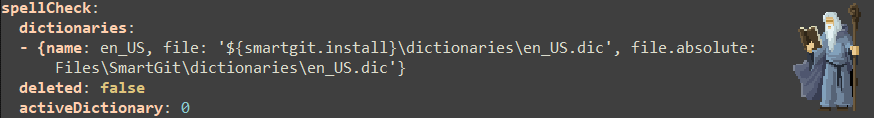

# [Crack] #0 - SmartGit

Maintenant que j'ai quitté mon taff, je vais devoir réinstaller pas mal de choses..
Pour faire ce site web, j'ai suivi ce (très bon) [tutoriel](https://www.youtube.com/watch?v=m1RYsmOMPLs).
J'ai réinstallé Visual studio, me suis créé un nouveau compte Github, et me voilà.

Le problème c'est que les lignes de commande shell, ça commence doucement à me gaver.
Je me suis bien trop habitué à SmartGit, et c'est sous license...

    

Donc voilà, rien que pour vous.



1. Telecharger une version de SmartGit en 19.1 à partir [du site officiel](https://www.syntevo.com/smartgit/download/archive/).

2. Lance l'installeur, attends que ça termine, et si tu lances le logiciel ils te demanderont peut-être une license...  
	
3. Bonne pratique ici, supprime l'installeur ;)

4. Ouvre ton notepad et copie/colle ce code, puis enregistrez le fichier avec l'extension '.bat':
> @echo off 
> del %APPDATA%\syntevo\SmartGit\19.1\preferences.yml
> rem pause

5. Lance le script, puis relance SmartGit à nouveau.
Desplegable:
	Il se passe rien?  
	Sur la dernière ligne, enlève le 'rem' et laisse juste le 'pause'.  
	De rien. Par contre je te préviens ça te lancera un shell à chaque démarrage eh.



Le logiciel fonctionne avec une license, mais a une version d'essai gratuite... Qui inclue toutes les features basiques de git, plus une interface pro.
Il fonctionne avec le fameux dossier %APPDATA% (local), où il crée un fichier de flags pour les préférences... incluant le temps qu'il vient checker
pour voir si ta version d'essai de 30 jours a pas expiré.

    

 

Le crack? Supprimer ce fichier quand ça te sort le message de "Gnegnegne ta version d'essai à expiré".



Bonus:  
Et si t'es un farouche, met ce script au startup (Windows > Planificateur de Tâches > Créer une tâche de base... > Toutes les semaines) et link le script.
Attention, dans les propriétés de la tâche, par défaut, elle ne s'executera que si la machine est sur secteur, décocher l'option. 

